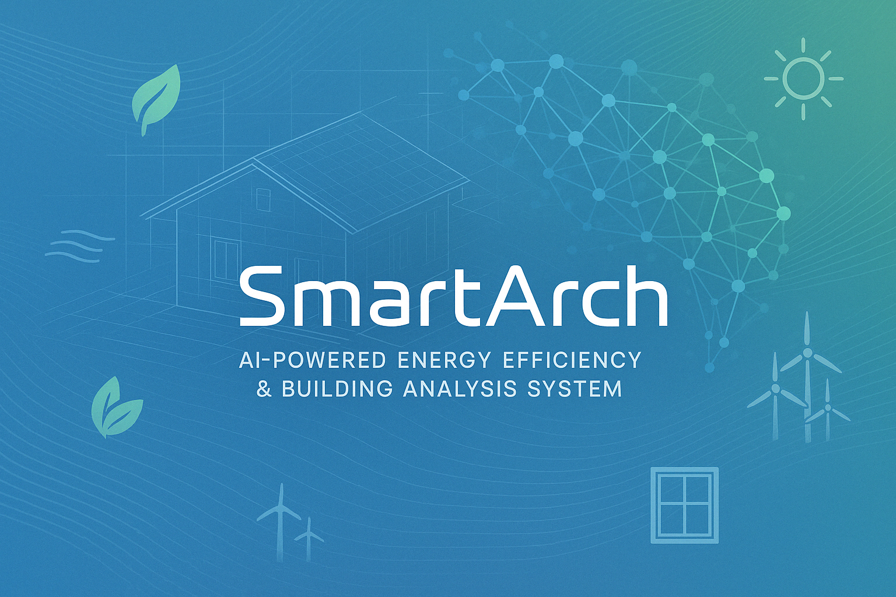

# Architectural Energy Efficiency Analyzer 🏗️

 

**Sixth Semester Mini Project** ·
A comprehensive system for analyzing building energy efficiency, developed as part of sixth semester academic requirements. Combines machine learning, computer vision, and environmental data analysis to provide architectural insights.

## 📚 Project Overview

This project fulfills the requirements for the sixth semester mini-project in Computer Science/Information Technology. Implements core concepts of:
- Machine Learning Pipelines
- API Integration
- Computer Vision Analysis
- Geospatial Data Processing
- Software Architecture Design

## ✨ Features

- 🏠 Floor plan image analysis using computer vision API
- 🌦️ Climate classification and seasonal adaptation
- 🔮 Energy efficiency prediction with Random Forest regression
- 🌍 Real-time weather integration
- 📊 Room-by-room architectural recommendations
- 🍃 Sustainable material suggestions

## 👥 Contributors

This project was developed with contributions from:

- [Aswin Jacob Thomas](https://github.com/AswinJac)
- [Akshay V V](https://github.com/Akshayyvv)
- [Malavika Sreekumar](https://github.com/MalavikaSreekumar16)


## 🛠️ Installation 

### Prerequisites
- Python 3.10+
- PIP package manager
- API keys for:
  - Google Gemini
  - OpenCage Geocoder
  - OpenWeatherMap

### Step-by-Step Setup

1. **Clone the repository**
   ```bash
   git clone https://github.com/yourusername/energy-efficiency-analyzer.git
   cd energy-efficiency-analyzer

## 📋 Usage Example

 

## 📊 Presentation Slides

 


## 🚀 Project Roadmap

🚀 Phase 1: Research & Setup (Months 1-2)


- Market analysis & tech stack selection
- Data collection (floor plans, climate, materials)
- Environment setup & documentation framework

💻 Phase 2: Core Development (Months 3-5)


- Floor plan analysis (Gemini AI integration)
- Climate analysis (OpenCage, OpenWeather, Open-Meteo APIs)
- ML model training (RandomForestRegressor) for efficiency prediction

📈 Phase 3: Recommendation Engine (Months 6-7)


- Room-by-room efficiency scoring
- Window, ventilation, material optimization algorithms
- Cost-benefit and passive design suggestions

🎨 Phase 4: UI & API Integration (Months 8-9)


- REST API development
- Responsive web interface & report visualizations
- Floor plan upload & recommendation display

🛠️ Phase 5: Testing & Refinement (Months 10-11)


- Unit, integration, and performance testing
- Model tuning, UI/UX improvements, and system optimization

🌟 Phase 6: Launch & Future Plans (Month 12+)


- Production deployment & support setup
- Future roadmap: real-time monitoring, mobile app, 3D modeling, BIM integration

